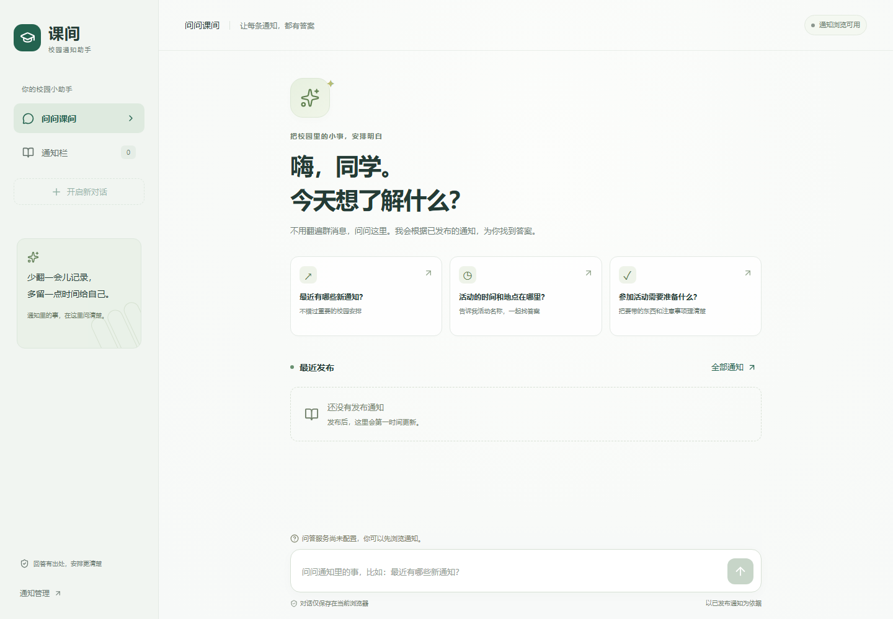
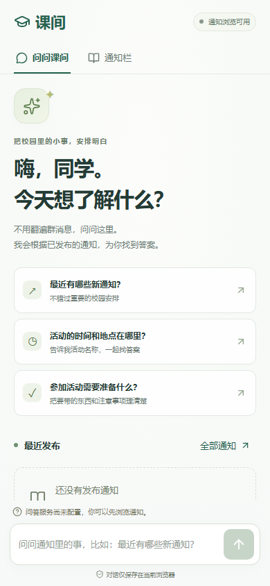
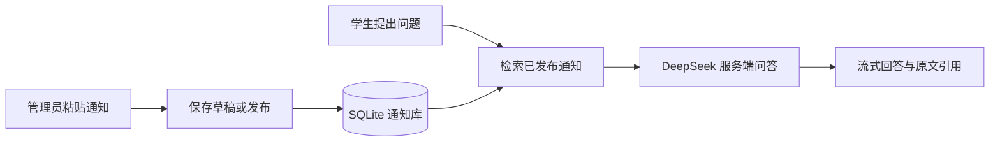

# 课间 · 校园通知助手

一个基于 **DeepSeek** 的校园通知问答网页应用。老师粘贴通知，学生打开链接即可查看通知、提问和追问，每个回答都可以回到通知原文核对。

**手机优先 · 无需学生注册 · 标题选填 · 自动发布时间 · 回答附来源**

> 本项目由管理员在后台录入通知，不自动读取微信群，也不在微信群内回复。可将网站链接分享到微信群供学生访问。

## 界面预览



<p align="center"></p>

截图展示未配置模型时的界面；填写自己的 DeepSeek Key 后即可开启问答。示例数据不会自动进入真实通知库。

## 功能一览

| 面向谁 | 功能 |
|---|---|
| 学生 | 手机/电脑浏览、通知搜索、原文查看、连续追问、流式回答、来源跳转 |
| 学生 | 停止生成、失败重试、本浏览器历史记录、清空对话 |
| 管理员 | 密码登录、粘贴正文、标题选填、保存草稿、发布、编辑、撤下 |
| 管理员 | 点击发布时自动记录服务器时间，统一以北京时间显示 |
| 部署维护 | SQLite 持久化、在线备份、Docker、请求限流、服务端密钥 |

未配置 API Key 时可以正常管理和浏览通知，问答会明确提示尚未配置。

## 工作方式



无需训练模型或单独配置向量服务。草稿不参与公开查询；发布后的修改会立即影响下一次问答。

## 快速启动

需要 **Node.js 24.x**（使用内置 SQLite）和 npm。首次启动不会自动加载演示通知。

```powershell
git clone https://github.com/wantedfast/campus-notice-bot.git
cd campus-notice-bot
npm ci
npm run setup
npm run dev
```

打开 http://localhost:3000，管理入口是 `/admin`。开发服务监听所有网卡，可用同一局域网手机访问 `http://电脑IP:3000`；相应把 `APP_URL` 改为这个地址后重启，管理员和聊天请求必须从该地址打开。不要同时混用 localhost 和 IP 作为写入入口。

`npm run setup` 创建 `.env.local` 并生成随机管理员密码和会话密钥，不覆盖已有文件。请在该本机文件查看 `ADMIN_PASSWORD` 用于登录。也可手动复制 `.env.example`，自行填写密码和密钥。

编辑 `.env.local`：

| 变量 | 设置 |
|---|---|
| `ADMIN_PASSWORD` | 自选至少 6 字符的管理员密码，无默认密码 |
| `SESSION_SECRET` | 独立随机密钥，至少 32 字符 |
| `DEEPSEEK_API_KEY` | 后续填写真实 DS Key；留空时通知功能正常、问答明确提示未配置 |
| `DEEPSEEK_MODEL` | 默认 `deepseek-v4-flash`，可替换为账号可用模型 |
| `DEEPSEEK_BASE_URL` | 默认 `https://api.deepseek.com`，仅服务端配置；测试使用本地模拟服务 |
| `APP_URL` | 用户实际访问的完整站点地址，例如 `https://notice.example.com`，不带路径 |
| `DATABASE_PATH` | 默认 `./data/campus.sqlite` |
| `CHAT_TIMEOUT_MS` | 默认 45000，总等待上限；最多 120000 |
| `TRUST_PROXY` | 仅当受控反向代理覆盖 X-Forwarded-For 时设为 `true` |

可用以下命令生成会话密钥，将结果粘贴到 `.env.local`：

```powershell
node -e "console.log(require('crypto').randomBytes(32).toString('hex'))"
```

环境变量修改后重启服务。Key 不会进入浏览器包、响应或应用日志。没有真实 Key 的版本不提供伪造回答，也不会自动调用其他模型。

## 使用流程

1. 打开 `/admin`，输入管理员密码。
2. 新建通知，粘贴正文，标题可选填；发布时间由服务器在点击发布时自动记录（北京时间）。可先保存草稿。
3. 点击发布。学生立即可以在 `/notices` 查看原文，下一次问答即读取更新后的资料。
4. 将网站链接分享到微信群。学生从微信打开，无需登录。
5. 修改通知需再次发布；撤下后停止公开访问及用于新回答。学生浏览器已保存的旧对话不会被远程删除。

通知是公共内容，持有链接的人均可访问；管理页明确提示这一点。第一版只管理一个通知库，不包含微信采集、群内回复、学生账户、文件上传或 OCR。

### 手机与对话

- 360px 起单栏布局，底部安全区和 Visual Viewport 适配；输入文字为 16px，支持中文输入法。
- 手机 Enter 换行，点击发送按钮提交；电脑 Enter 发送、Shift+Enter 换行。
- 支持流式回答、停止、失败重试、连续追问、来源链接及清空对话。
- 用户向上翻阅历史时不强制滚动。主动发送新问题后跟随新回答。
- 最近 40 条消息仅保存在当前浏览器 localStorage；每次请求发送最近最多 12 条有效消息到服务器和 DeepSeek。服务器不持久化学生对话。
- 历史对话中的引用原文已撤下时，打开链接会显示“通知暂时无法查看”。
- 通知列表在页面返回前台和每 30 秒刷新；问答每次直接读取数据库，不依赖列表刷新。

## 架构与接口

Next.js App Router + TypeScript + Tailwind CSS；Node.js 内置 SQLite 开启 WAL；原生 fetch 连接 DeepSeek Chat Completions SSE。单实例部署，无需额外向量数据库或 Embedding Key。

检索采用中文双字片段、关键词、标题加权和最近对话上下文；最新通知按发布时间降序。每次选择最多 8 条已发布通知。系统提示规定资料边界、冲突报告和来源引用，服务端过滤不存在的数字引用。此方法并不保证覆盖所有同义表达；真实模型的事实准确性和抗提示注入效果需用真实 Key 再评估。

| 接口 | 行为 |
|---|---|
| `GET /api/notices?q=关键词` | 已发布通知、最近更新时间、`chatReady`；标题或正文包含匹配 |
| `GET /api/notices/:id` | 公开原文；草稿、撤下或不存在均为 404 |
| `POST /api/chat` | `{messages:[{role:'user'或'assistant',content:string}]}`；返回 SSE |
| `GET /api/admin/session` | 返回是否已认证、管理员配置是否齐全 |
| `POST /api/admin/session` | `{password:string}` 登录，签发 HttpOnly Cookie |
| `DELETE /api/admin/session` | 清除登录 Cookie |
| `GET /api/admin/notices` | 已认证管理员查看全部通知，包括草稿 |
| `POST /api/admin/notices` | 创建通知，成功 201 |
| `PUT /api/admin/notices/:id` | 更新通知，包括发布、撤下；不存在为 404 |

通知写入字段为 `title`（选填，最多 120 字符）、`body`（1–16000 字符）、`status`（`draft` / `published`）。服务端生成 `id`、`createdAt`、`updatedAt`；每次点击发布（包括编辑后重新发布）时，以服务器当前时间设置 `noticeAt`，忽略客户端传入的时间。保存草稿不产生新的发布时间，草稿列表显示保存时间。已有通知保留原记录，直到再次发布。标题留空时，列表和引用用正文首行摘要显示，不修改存储的空标题。时间存 UTC，界面统一显示北京时间。

聊天 SSE 事件：`sources`（编号与通知元数据数组）、`token`（`{text}`）、`done`（`{}`）、`error`（`{error}`）。客户端遇到 error 或无 done 的断流，会保留已生成内容并标明不完整。HTTP 阶段错误为 `{error:string}`。

### 运行边界

- 所有写入请求校验 Origin。管理接口另外校验 8 小时有效的 HMAC 会话；更改密码或会话密钥会使旧会话失效。退出清除本地 Cookie。
- 聊天每条最多 4000 字符、最多 12 条、JSON 最多 52KB；界面单次输入上限 2000 字符。通知写入最大 70KB。
- 全站最多 60 次聊天请求/分钟、4 个并发生成。启用可信代理后，额外限制每 IP 12 次/分钟；未启用时使用全站共享限制，不相信客户端伪造的 IP 头。
- 管理登录每来源最多 8 次/15 分钟，全站最多 30 次/15 分钟。未启用代理时来源配额共享。
- 速率计数保存在单进程内存，重启会重置。此版本不可直接扩为多个实例。
- 日志只记录请求状态、耗时或错误类别，不记录 Key、通知正文和完整对话。

## 生产部署

```powershell
npm run build
npm start
```

也可用 Docker（Linux 容器）：

```bash
docker compose up -d --build
```

Compose 从 `.env.local` 读取环境，使用 `campus-data` 命名卷存数据库，并只把服务暴露到宿主机 `127.0.0.1:3000`。Docker 镜像使用 Next.js standalone 产物、非 root 用户运行，不包含 `.env.local` 或数据库。

在公网域名上配置 HTTPS 反向代理，把 `APP_URL` 设置为该域名。下面示例放入已经配置 TLS 的 Nginx `server` 中：

```nginx
location / {
    proxy_pass http://127.0.0.1:3000;
    proxy_set_header Host $host;
    proxy_set_header X-Forwarded-For $remote_addr;
    proxy_set_header X-Forwarded-Proto $scheme;
    proxy_http_version 1.1;
    proxy_buffering off;
    proxy_read_timeout 130s;
    client_max_body_size 128k;
}
```

确认服务仅接受此代理流量后，才设置 `TRUST_PROXY=true`。HTTPS 的 APP_URL 会启用登录 Cookie 的 Secure 属性。不要在临时无持久磁盘的 serverless 平台上运行此 SQLite 版本。

Docker 配置已提供；是否成功构建、微信实机效果和公网部署状态见 [验证记录](VALIDATION.md)，未执行项不会标为已验证。

## 备份与恢复

本地或有完整源码的服务器执行：

```powershell
npm run backup
# 可指定文件名，路径相对于项目目录
npm run backup -- backups/manual.sqlite
```

使用 SQLite 在线备份 API 生成一致快照，可在应用运行时执行。脚本读取 `.env.local`，默认输出到 `backups/`；备份包含公开通知和草稿，应按管理数据保存。

Docker 运行时可在命名卷生成在线快照，再复制出来：

```bash
docker compose exec campus node -e "const {DatabaseSync,backup}=require('node:sqlite');const d=new DatabaseSync('/app/data/campus.sqlite');backup(d,'/app/data/backup.sqlite').then(()=>d.close())"
docker compose cp campus:/app/data/backup.sqlite ./backup.sqlite
```

恢复时先停止应用，备份当前数据库目录，再把快照放到配置的 DATABASE_PATH。移开旧数据库对应的 `-wal` 和 `-shm` 文件，避免它们与恢复的快照混用；Docker 中保留文件对 node 用户（UID 1000）的读写权限，再启动服务并检查通知列表。

建议定期备份并保留异地副本；备份前后的文件校验与恢复演练由部署方安排。不要仅在服务运行时复制主 `.sqlite` 文件而遗漏 WAL。

## 演示与测试

`npm run demo` 是唯一主动填充演示数据的入口。它加载 3 条带“【演示】”标记的通知，数据库已有通知时拒绝执行。使用独立 DATABASE_PATH，避免与真实内容混用。

```powershell
npm test
npm run build
npx playwright install chromium
npm run test:e2e
npm run typecheck
```

端到端测试自动启动本地模拟 DeepSeek（3198）及生产应用（3199），使用临时 SQLite、测试专用管理员密码，不需要真实 Key。模拟服务不会在普通启动时运行。

真实 Key 补充后，需追加检查：真实流式响应与停止、常见学生提问、明确更正与冲突通知、资料不存在时拒答、恶意通知不能改变系统规则。模型输出仍应以通知原文为准。

## 目录说明

```text
src/app/          学生页面、通知页面、管理后台及 API
src/components/   手机和桌面共用的聊天界面
src/lib/          SQLite、检索、DeepSeek、校验与会话
scripts/          初始化、启动、演示数据、备份和测试服务
tests/            核心测试与 Playwright 浏览器测试
previews/         界面截图
```

仓库不包含 API Key、管理密码、真实数据库或服务器登录信息。请为自己的部署运行 `npm run setup`，配置 `.env.local`，不要把该文件提交到 GitHub。
